# Atividade 02 — Tarefa 1: Estudo Dirigido TensorFlow Playground

Disciplina: Aprendizado Profundo (PPGTI-UFRN) — Prof. Josenalde Oliveira
Aluno: Daniel Ballester

Exploração guiada do [TensorFlow Playground](https://playground.tensorflow.org) conforme o estudo dirigido, seguida das respostas aos exercícios de fixação sobre hiperparâmetros de MLP.

## a) Padrões aprendidos por uma NN


Configuração padrão: dataset circular, 2 features (X1, X2), 2 camadas ocultas (4 e 2 neurônios), ativação tanh, learning rate 0,03. Após 687 épocas a rede converge com **perda de treino 0,000 e perda de teste 0,001**. A fronteira de decisão aprendida é aproximadamente circular, coincidindo com a fronteira real dos dados (círculo azul interno cercado por pontos laranja). As arestas azuis nas conexões indicam pesos positivos (o neurônio contribui de forma direta para a ativação seguinte) e as arestas laranja, pesos negativos — a espessura da aresta é proporcional à magnitude do peso. Os 4 neurônios da primeira camada aprendem padrões simples (retas/curvas parciais, visíveis nos pequenos quadrados de cada neurônio), e os 2 neurônios da segunda camada combinam esses padrões simples em uma fronteira mais complexa e curva.

## b) Função de ativação: tanh vs ReLU vs Linear

Mesmo dataset e arquitetura do item (a), variando apenas a ativação.

| Ativação | Épocas até estabilizar | Perda treino | Perda teste | Screenshot |
|---|---|---|---|---|
| Tanh | 687 | 0,000 | 0,001 | 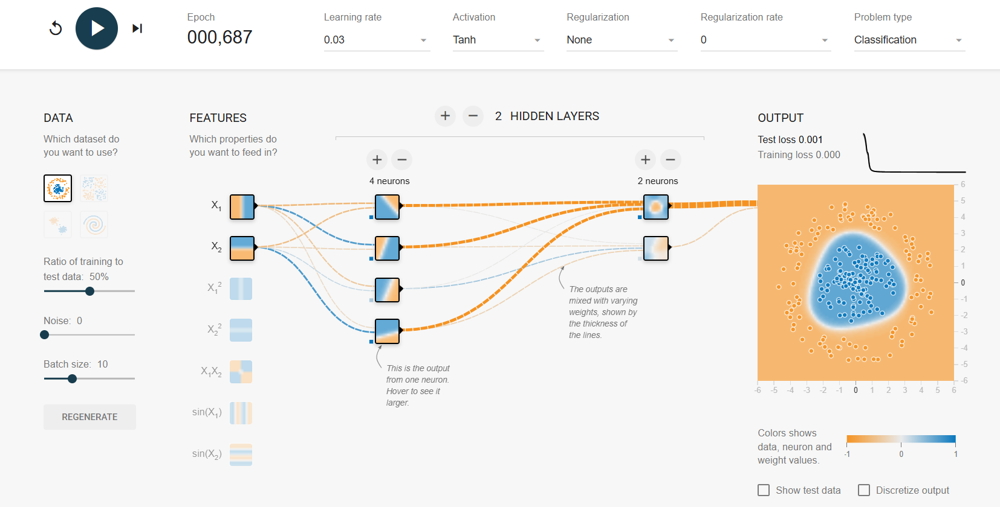 |
| ReLU | 1182 | 0,000 | 0,003 | 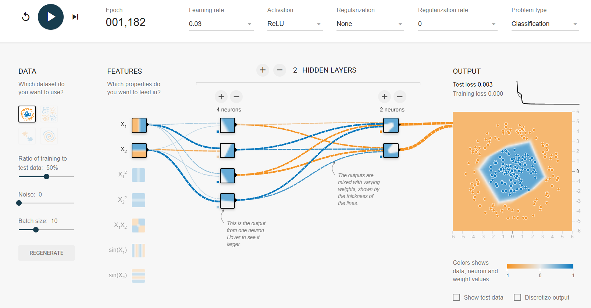 |
| Linear | 1111 | 0,494 | 0,509 | 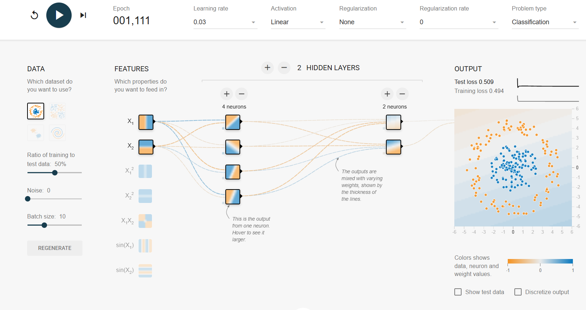 |

**Observações:**
- **Tanh** converge rapidamente para uma perda praticamente nula, com fronteira suave e curva, bem ajustada ao círculo.
- **ReLU** também converge bem (perda de teste baixa, 0,003), porém precisou de mais épocas (1182 vs 687) para estabilizar nesta execução, e a fronteira de decisão fica com formato de "losango"/facetado (linhas retas por partes), reflexo da natureza linear-por-partes da função ReLU — diferente da curva suave da tanh.
- **Linear** **não consegue** classificar o problema: a perda de teste fica em 0,509 (equivalente a chute aleatório) e a fronteira aprendida é uma única reta diagonal, incapaz de separar um padrão circular. Isso confirma que uma rede com apenas ativações lineares — não importa quantas camadas — colapsa matematicamente em uma única transformação linear, sem capacidade de aprender fronteiras não lineares.

## c) Taxa de aprendizagem (learning rate)

Ativação fixada em tanh, demais parâmetros default, variando somente o learning rate.

| Learning rate | Épocas | Perda treino | Perda teste | Screenshot |
|---|---|---|---|---|
| Alto (3) | 11.902 | 0,336 | 0,465 | 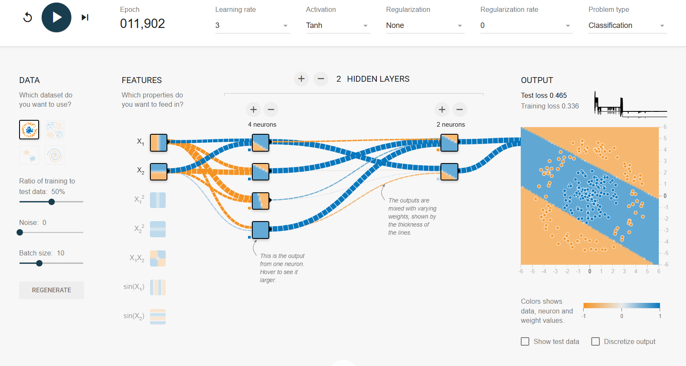 |
| Baixo (0,0001) | 9.844 | 0,069 | 0,077 | 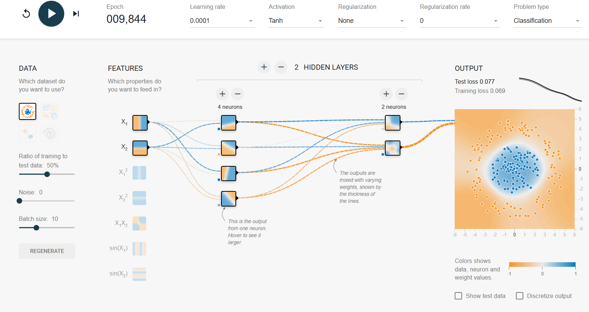 |

**Observações:** com **learning rate muito alto (3)**, a curva de perda fica instável e ruidosa (picos visíveis no gráfico), e mesmo após quase 12 mil épocas a rede não converge bem — a fronteira aprendida vira uma reta diagonal simples (perda de teste 0,465), pois os passos de atualização são grandes demais e "pulam" o mínimo da função de perda. Com **learning rate muito baixo (0,0001)**, a curva de perda é suave e decrescente, mas a convergência é muito lenta: mesmo com quase 10 mil épocas, a perda de teste ainda está em 0,077 (não tão baixa quanto os 0,001 obtidos com o learning rate padrão de 0,03 em poucas centenas de épocas) — a fronteira já é quase circular, mas o treinamento ainda não finalizou completamente.

## d)-(f) Risco de mínimos locais (1 camada oculta)

Arquitetura com **1 única camada oculta**, ativação tanh, dataset circular.

**3 neurônios (2 tentativas):**

| Tentativa | Épocas | Perda treino | Perda teste | Screenshot |
|---|---|---|---|---|
| 1 | 489 | 0,005 | 0,010 | 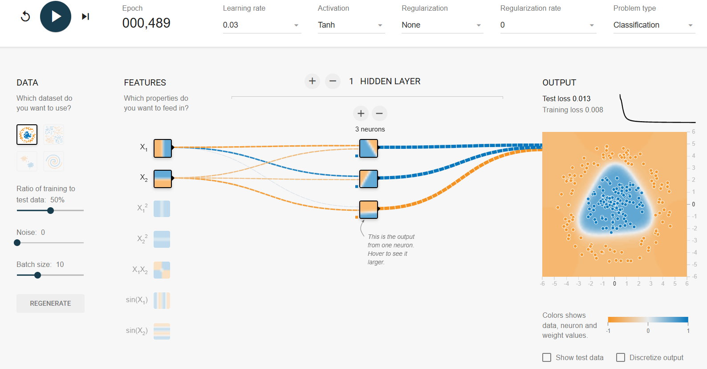 |
| 2 (reset) | 813 | 0,008 | 0,013 | 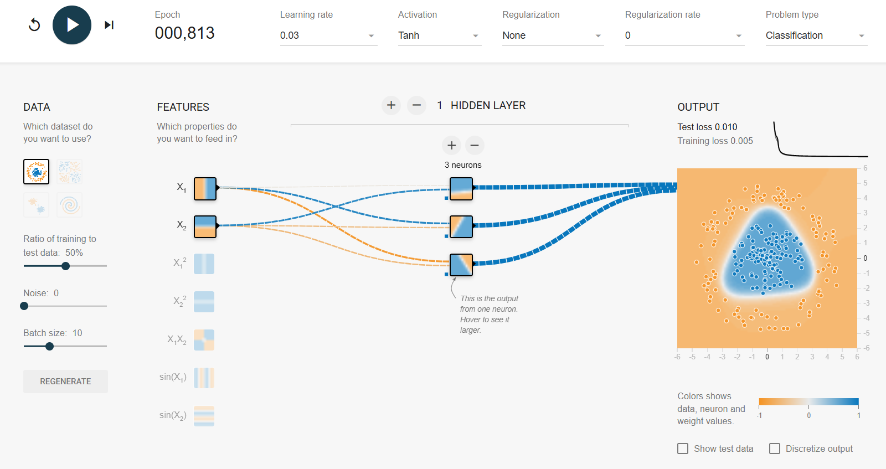 |

Nas duas tentativas capturadas a rede convergiu bem (fronteira triangular estável, perda de teste baixa em ambas), mas o **número de épocas necessárias variou** consideravelmente entre execuções (489 vs 813) só por causa da inicialização aleatória diferente dos pesos após o Reset — evidenciando a sensibilidade do treinamento com poucos neurônios à inicialização, mesmo quando ambas as tentativas eventualmente escapam de mínimos locais ruins.

**2 neurônios:**

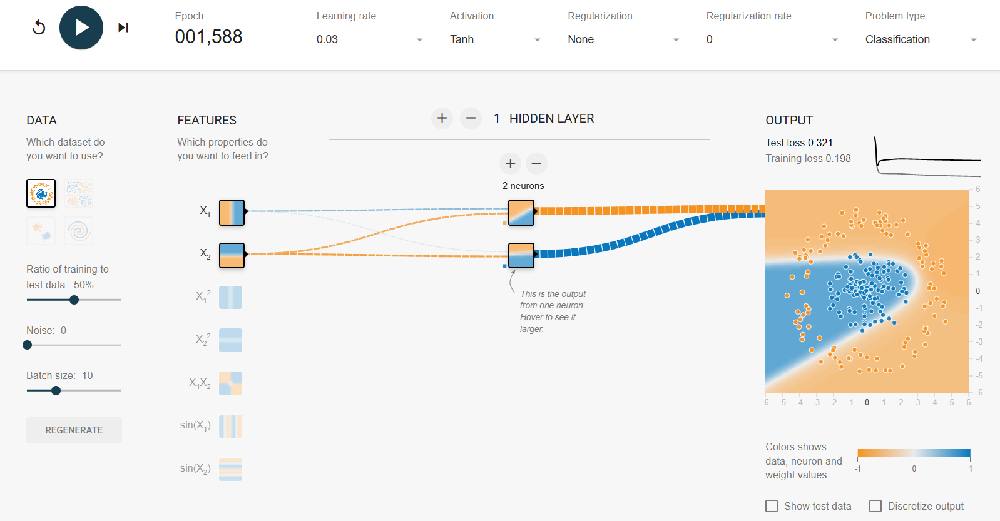

Com apenas 2 neurônios na camada oculta, a rede (epoch 1588) fica presa em uma solução parcial: perda de treino 0,198 e perda de teste 0,321, nitidamente piores que com 3 ou 8 neurônios. A fronteira de decisão é uma forma de "cunha" que cobre só parte da região circular, deixando pontos azuis do lado errado — o modelo tem parâmetros insuficientes para representar a fronteira circular adequadamente, confirmando a limitação de capacidade descrita no estudo dirigido.

**8 neurônios:**

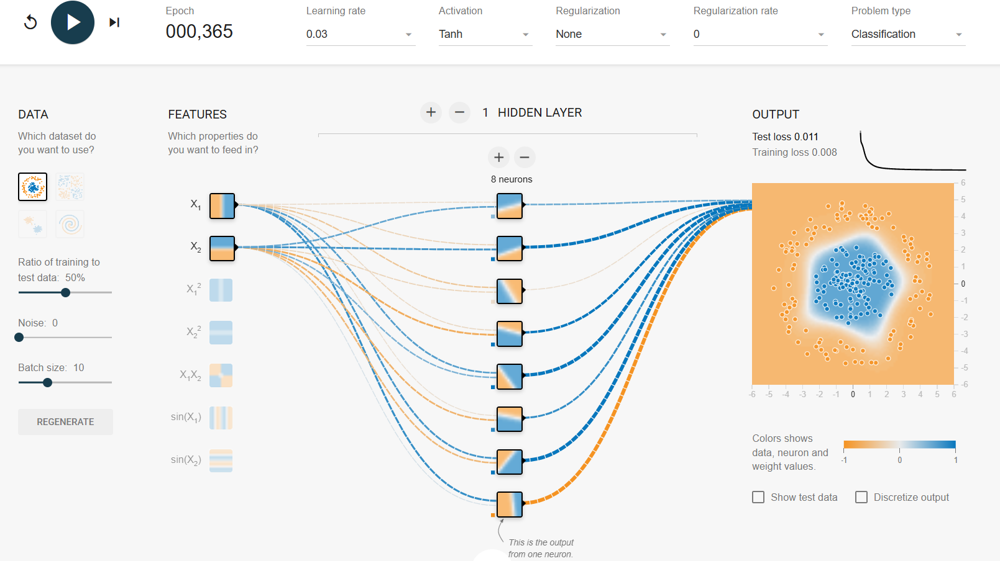

Com 8 neurônios, a convergência é rápida (365 épocas) e de alta qualidade (perda de treino 0,008, perda de teste 0,011) — bem mais rápida que as tentativas com 3 neurônios (489-813 épocas) e sem indício de travamento. Isso é consistente com a observação de que redes maiores (mais parâmetros) tendem a não ficar presas em mínimos locais ruins, pois o espaço de perda tem mais caminhos de descida disponíveis.

## g) Dataset em espiral, 4 camadas ocultas × 8 neurônios

Arquitetura fixa (4 camadas ocultas, 8 neurônios cada, tanh), variando learning rate e regularização.

| Configuração | Épocas | Perda treino | Perda teste | Screenshot |
|---|---|---|---|---|
| Base (lr=0,03, sem regularização) | 1245 | 0,000 | 0,087 | 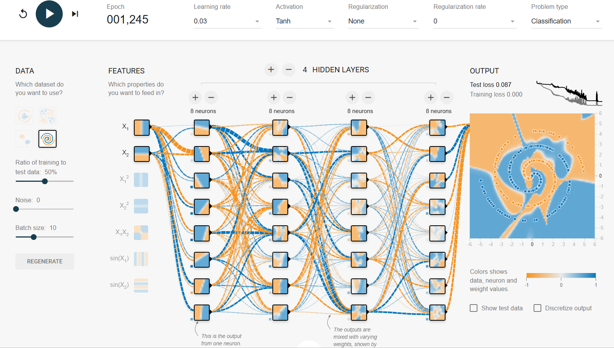 |
| Learning rate alto (lr=1) | 2629 | 0,432 | 0,470 | 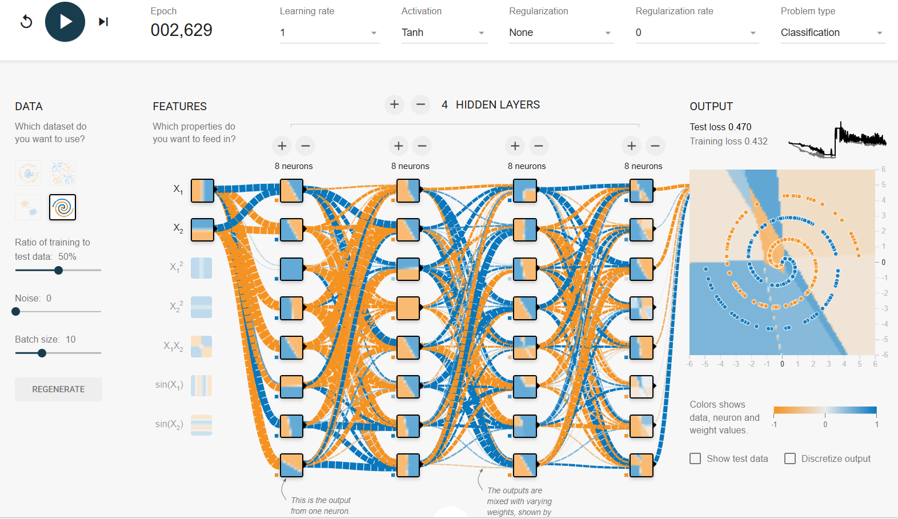 |
| Regularização L1 (0,001) | 7949 | 0,076 | 0,206 | 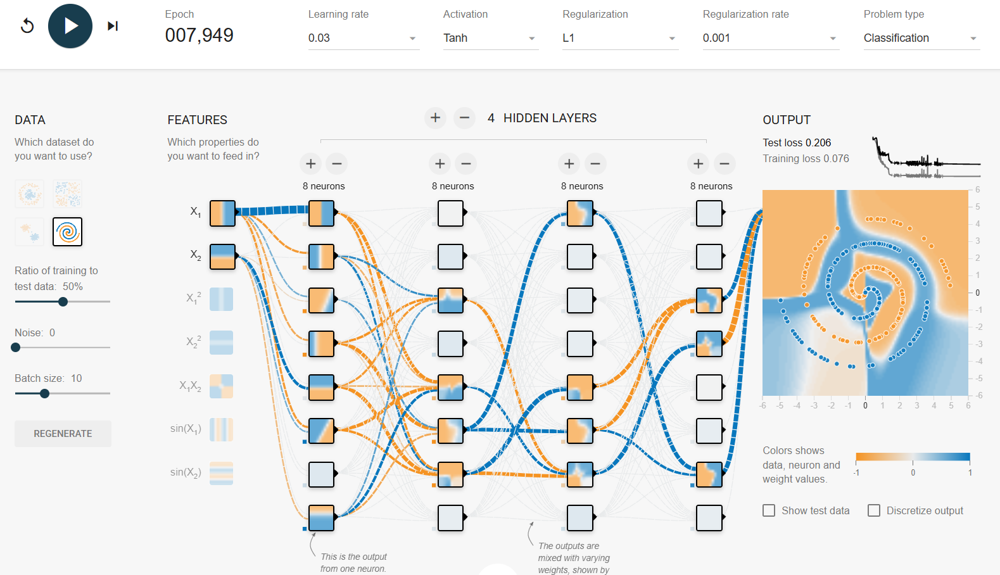 |
| Regularização L2 (0,001) | 1335 | 0,007 | 0,080 | 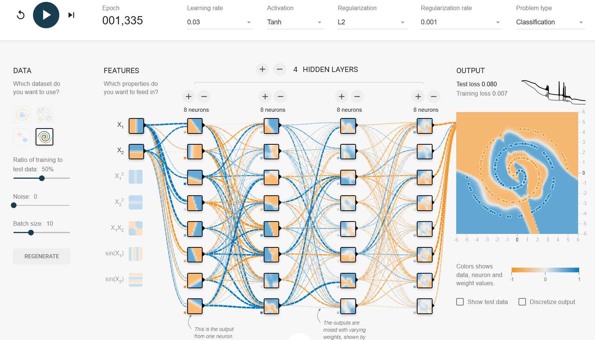 |

**Observações:**
- **Base:** a rede consegue capturar boa parte do padrão espiral, mas **perda de treino 0,000 vs perda de teste 0,087** evidencia overfitting nítido — o modelo memorizou o treino sem generalizar totalmente.
- **Learning rate alto (1):** a curva de perda fica bastante ruidosa (picos grandes), e mesmo com mais que o dobro de épocas (2629) a rede não consegue aprender a espiral — a fronteira degenera em poucas regiões grandes e retas, com perda de teste alta (0,470), mostrando que uma rede profunda (4 camadas) é ainda mais sensível a learning rates altos do que redes rasas.
- **Regularização L1:** provoca uma fronteira mais "blocada"/quadriculada e, visivelmente, vários neurônios das camadas intermediárias ficam com o quadrado em branco — sinal de que seus pesos foram zerados pela penalização L1 (indução de esparsidade). A perda de treino sobe para 0,076 (bem menos overfitting que a base) mas a perda de teste (0,206) fica pior que a da configuração base nesta execução — indicando que, aqui, o L1 com essa taxa (0,001) penalizou pesos demais para o número de épocas rodadas (quase 8 mil), prejudicando o ajuste fino do padrão espiral.
- **Regularização L2:** mantém todos os neurônios ativos (nenhum quadrado zerado, ao contrário do L1), produz uma fronteira mais suave que captura bem o formato da espiral, converge relativamente rápido (1335 épocas) e com perda de treino/teste mais equilibradas (0,007 / 0,080) — menos overfitting que a base, sem o efeito de esparsidade agressiva do L1.
- Em resumo: taxas de aprendizagem altas prejudicam desproporcionalmente redes profundas (mais propensas a explosão/instabilidade do gradiente); L1 tende a "podar" neurônios (esparsidade), enquanto L2 distribui a penalização suavemente entre todos os pesos, preservando mais neurônios ativos.

---

# Exercícios de fixação

## 1) Três funções de ativação populares

- **Sigmoide (logística)**: `σ(z) = 1 / (1 + e^-z)`. Formato em "S", satura em 0 (z → -∞) e 1 (z → +∞), centrada em 0,5 quando z = 0.
- **Tangente hiperbólica (tanh)**: `tanh(z) = (e^z - e^-z) / (e^z + e^-z)`. Também em "S", mas centrada em 0 e saturando em -1 e +1 — geralmente converge melhor que a sigmoide em camadas ocultas.
- **ReLU (Rectified Linear Unit)**: `ReLU(z) = max(0, z)`. É 0 para z negativo e cresce linearmente (inclinação 1) para z positivo — um "cotovelo" na origem, sem saturação do lado positivo, o que acelera a convergência (como observado no item (b) acima).

## 2) MLP com 10 entradas, 50 neurônios na camada oculta (ReLU) e 3 na saída (ReLU)

Notação de Géron (*Mãos à Obra*, 2ª ed., pp. 219-220): X = matriz de entradas (uma linha por instância, uma coluna por feature); W = pesos de conexão (uma linha por neurônio de entrada, uma coluna por neurônio na camada); b = vetor de viés (um valor por neurônio artificial da camada).

Seja `m` o número de instâncias (tamanho do lote):

a) **Matriz de entrada X**: formato `(m, 10)` — uma linha por instância, 10 colunas (uma por feature de entrada).

b) **Camada oculta**: `Wh` tem formato `(10, 50)` (10 neurônios de entrada × 50 neurônios ocultos); `bh` tem formato `(50,)` — um viés por neurônio oculto.

c) **Camada de saída**: `Wo` tem formato `(50, 3)` (50 neurônios ocultos × 3 neurônios de saída); `bo` tem formato `(3,)` — um viés por neurônio de saída.

d) **Matriz de saída Y**: formato `(m, 3)` — uma linha por instância, uma coluna por classe/saída.

e) **Equação de Y em função de Z, Wh, bh, Wo, bo** (com `Z = X·Wh + bh` sendo a pré-ativação da camada oculta):

```
Z = X · Wh + bh
Y = ReLU( ReLU(Z) · Wo + bo )
```

ou seja, `Y = ReLU( ReLU(X·Wh + bh) · Wo + bo )`.

## 3) Neurônios e ativação da camada de saída

- **Classificar e-mail em spam / não spam** (classificação binária): **1 neurônio** de saída, ativação **sigmoide**.
- **MNIST** (10 dígitos, classes mutuamente exclusivas): **10 neurônios** de saída, ativação **softmax**.
- **Predizer a cotação do dólar de amanhã** (regressão de valor contínuo): **1 neurônio** de saída, ativação **linear** (identidade, sem função de ativação restritiva).

## 4) Hiperparâmetros ajustáveis em uma MLP básica

- Número de camadas ocultas.
- Número de neurônios por camada.
- Função de ativação (por camada).
- Taxa de aprendizagem (learning rate) do otimizador.
- Otimizador (SGD, Adam, RMSprop, etc.) e seus parâmetros (momentum, beta1/beta2).
- Tamanho do lote (batch size).
- Número de épocas de treinamento.
- Tipo e intensidade de regularização (L1, L2, dropout).
- Inicialização dos pesos.
- Critério/paciência de early stopping.

**Se a MLP sobreajustar (overfitting) ao treinamento**, estratégias possíveis (ver também o efeito prático de L1/L2 observado no item (g) acima):
- Reduzir a complexidade do modelo (menos camadas/neurônios).
- Adicionar regularização L1 e/ou L2 aos pesos.
- Adicionar camadas de **dropout**.
- Usar **early stopping** monitorando a perda de validação.
- Aumentar a quantidade de dados de treino (ou aplicar *data augmentation*).
- Reduzir o número de épocas de treinamento.
- Simplificar/normalizar as features de entrada (ex.: batch normalization).
